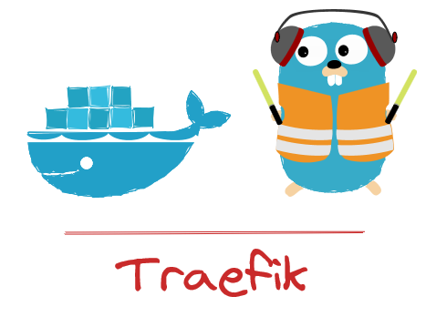

# Mise en place d'un reverse-proxy Traefik

<p align="center">
  
</p>


## Introduction :

Dans le monde de l'ingénierie DevOps, la mise en place d'une infrastructure fiable et efficace est essentielle pour le déploiement et la gestion des services. L'utilisation d'un reverse-proxy peut grandement faciliter ces tâches en offrant des fonctionnalités telles que le routage, l'équilibrage de charge et la sécurité des applications. Dans cet article, nous explorerons Traefik, un reverse-proxy spécialement conçu pour fonctionner dans un environnement Docker. Nous découvrirons comment Traefik simplifie le déploiement, la gestion et la sécurisation des services, tout en offrant une flexibilité et une évolutivité accrues.


## Concepts clés :

#### Routage dynamique :
Traefik permet d'établir des règles de routage flexibles pour diriger les requêtes entrantes vers les services appropriés. Ces règles peuvent être basées sur divers critères tels que l'hôte, le chemin, les en-têtes HTTP, etc. Grâce à cette fonctionnalité, Traefik offre une gestion fine du trafic et une redirection efficace vers les instances de service correspondantes.


#### Équilibrage de charge :
Un autre aspect important du reverse-proxy Traefik est sa capacité à effectuer un équilibrage de charge automatique. Il répartit intelligemment les requêtes entre les différentes instances d'un service, améliorant ainsi les performances et la disponibilité des applications. L'utilisation d'algorithmes d'équilibrage de charge tels que le round-robin garantit une distribution équitable du trafic.


#### Découverte automatique des services :
Traefik simplifie la gestion des services en offrant une découverte automatique des conteneurs Docker. Il surveille en permanence l'état des conteneurs et met à jour dynamiquement sa configuration pour inclure les nouveaux services ou exclure ceux qui ne sont plus disponibles. Cette fonctionnalité permet un déploiement agile et réactif aux changements de l'environnement.


#### Intégration avec Let's Encrypt :
La sécurité des communications est essentielle dans tout environnement de production. Traefik facilite la sécurisation des applications en intégrant nativement Let's Encrypt. Il peut générer et gérer automatiquement les certificats SSL/TLS nécessaires, permettant ainsi une communication sécurisée entre les clients et les services.


#### Métriques et observabilité :
Pour surveiller les performances du reverse-proxy et des services déployés, Traefik expose des métriques au format Prometheus. Ces métriques permettent de collecter des données en temps réel et de les visualiser à l'aide d'outils tels que Grafana. Cette fonctionnalité offre une meilleure observabilité, permettant la détection rapide des problèmes et l'optimisation des performances de l'infrastructure.


## Architecture :


La configuration de Traefik repose sur trois éléments clés : les entrypoints, les routers et les services. Comprendre ces concepts est essentiel pour tirer pleinement parti des fonctionnalités de Traefik.


#### EntryPoints :


Un entrypoint est un point d'entrée pour le trafic dans Traefik. Il définit le protocole et le port d'écoute pour le reverse-proxy. Par exemple, vous pouvez configurer un entrypoint pour le trafic HTTP sur le port 80 et un autre entrypoint pour le trafic HTTPS sur le port 443. Les entrypoints permettent à Traefik de gérer les requêtes entrantes et de les acheminer vers les services appropriés en fonction des règles de routage.


#### Routers :


Les routers définissent les règles de routage pour diriger les requêtes vers les services appropriés. Un router associe un entrypoint à un ou plusieurs services en fonction de critères spécifiques tels que l'hôte, le chemin, les en-têtes HTTP, etc. Par exemple, vous pouvez configurer un router pour rediriger toutes les requêtes entrantes avec un certain hôte ("example.com") vers un service spécifique. Les routers offrent une flexibilité et une granularité dans la définition des règles de routage pour répondre aux besoins spécifiques de votre infrastructure.


#### Services :


Un service représente l'application ou le service que vous souhaitez exposer via Traefik. Il peut s'agir d'un conteneur Docker, d'un service Kubernetes ou d'une autre entité. Traefik utilise les services pour acheminer le trafic vers les instances appropriées. Chaque service peut être associé à un ou plusieurs routers, ce qui permet de gérer différentes routes pour un même service en fonction de critères spécifiques.

L'architecture globale de Traefik repose sur cette combinaison d'entrypoints, de routers et de services. Les entrypoints permettent de recevoir le trafic entrant, les routers définissent les règles de routage et les services représentent les applications ou services à exposer. Cette approche modulaire et flexible permet une configuration fine du reverse-proxy et facilite la gestion des flux de trafic dans un environnement Docker.


## Partie TP

Dans cette partie pratique, nous allons configurer un reverse-proxy Traefik dans un environnement Docker en utilisant une configuration docker-compose. Suivez les étapes ci-dessous pour mettre en place l'environnement, configurer Traefik et afficher le tableau de bord Traefik :


#### Étape 1 : Installation de Docker et de docker-compose
Assurez-vous d'avoir Docker et docker-compose soient installés sur votre machine en suivant les instructions officielles adaptées à votre système d'exploitation. Une fois les deux installés, vous êtes prêt à passer à l'étape suivante.


#### Étape 2 : Création du fichier docker-compose.yml
Créez un fichier nommé "docker-compose.yml" et ajoutez le contenu suivant :

```
version: "3"

services:
  traefik:
    image: traefik:v2.5
    ports:
      - "80:80"
      - "8080:8080"
    volumes:
      - /var/run/docker.sock:/var/run/docker.sock
    command:
      - "--api.insecure=true"
      - "--providers.docker=true"
      - "--providers.docker.exposedbydefault=false"
      - "--entrypoints.web.address=:80"
      - "--entrypoints.dashboard.address=:8080"
    labels:
      - "traefik.enable=true"
      - "traefik.http.routers.traefik.rule=Host(`traefik.example.com`)"
      - "traefik.http.routers.traefik.entrypoints=dashboard"
      - "traefik.http.routers.traefik.service=api@internal"

  webserver:
    image: nginx:latest
    labels:
      - "traefik.enable=true"
      - "traefik.http.routers.webserver.rule=Host(`example.com`)"
      - "traefik.http.routers.webserver.entrypoints=web"
      - "traefik.http.routers.webserver.service=webserver@docker"

  whoami:
    image: containous/whoami
    labels:
      - "traefik.enable=true"
      - "traefik.http.routers.whoami.rule=Host(`whoami.example.com`)"
      - "traefik.http.routers.whoami.entrypoints=web"
      - "traefik.http.routers.whoami.service=whoami@docker"
```

Dans ce fichier de configuration, nous définissons un service Traefik en utilisant l'image "traefik:v2.5". Nous exposons les ports 80 et 8080 pour le trafic HTTP et pour accéder à l'interface Web de Traefik. Le volume "/var/run/docker.sock" est monté pour permettre à Traefik de découvrir les services Docker. Les services "webserver" utilisant l'image Nginx et "whoami" utilisant l'image "containous/whoami" sont également définis avec leurs labels correspondants pour le routage avec Traefik.

Nous avons ajouté les paramètres supplémentaires pour les conteneurs "webserver" et "whoami". Les paramètres "--entrypoints.web.address=:80" définissent l'entrypoint "web" pour les deux services. Les labels "traefik.http.routers.webserver.entrypoints=web" et "traefik.http.routers.whoami.entrypoints=web" spécifient l'entrypoint "web" pour le routage des requêtes HTTP.


#### Étape 3 : Démarrage du service
Pour démarrer les services, exécutez la commande suivante :

```
docker-compose up -d
```

Cela va démarrer Traefik, les services "webserver" et "whoami", ainsi que le tableau de bord de Traefik.


#### Étape 4 : Vérification du routage et accès au tableau de bord
Maintenant, ouvrez votre navigateur et accédez à http://example.com. Vous devriez voir la page par défaut de Nginx, ce qui confirme que le routage fonctionne correctement.

Pour tester le service "whoami", accédez à http://whoami.example.com. Vous devriez voir une page affichant des informations sur le conteneur "whoami", ce qui confirme que le routage vers le service "whoami" fonctionne correctement.

Pour accéder au tableau de bord de Traefik, ouvrez votre navigateur et accédez à http://traefik.example.com:8080. Vous serez redirigé vers le tableau de bord de Traefik où vous pourrez consulter et gérer la configuration du reverse-proxy.


## Conclusion :
Félicitations ! Vous avez réussi à configurer un reverse-proxy Traefik en utilisant une configuration docker-compose, à configurer le routage des requêtes vers les différents services et à afficher le tableau de bord de Traefik. L'utilisation de Traefik avec docker-compose facilite la mise en place de services et le routage du trafic réseau dans vos applications conteneurisées. Continuez à explorer les fonctionnalités de Traefik pour optimiser et sécuriser vos déploiements.
